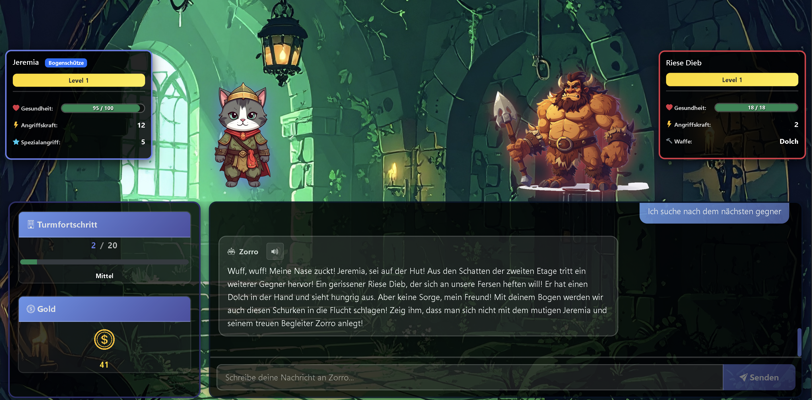

# MagicTower

MagicTower is a text-based fantasy adventure that feels like a journey through an ancient, living tower. Behind every door, new enemies, loot, decisions, and short narrative moments await, while an AI-assisted Game Master accompanies the adventure. The player guides a hero floor by floor upward, survives battles, upgrades equipment, and tries to reach the top of the tower.

## Game Concept

At its core is a lightweight RPG system with three character classes, multiple difficulty levels, and a turn-based combat flow. The game combines classic tower crawler elements with modern web technology and AI integration for chat and story interactions.

Key gameplay elements:

- Three classes: Warrior, Archer, Druid
- Tower progression across multiple floors depending on difficulty
- Turn-based battles with normal and special attacks
- Boss fights at regular intervals
- Gold, weapons, upgrades, and progress per session
- Chat-based interaction through Web API, MCP Tool, and n8n

## Technical Overview

A central architectural characteristic of MagicTower is the separation between generative interaction and deterministic system execution. The large language model handles narrative guidance, dialog design, and context-sensitive interpretation of player actions. The actual execution of gameplay-relevant operations, however, is not performed freely by the model itself, but in a controlled way through the MCP Tool. This turns generative capabilities into clearly defined, reproducible, and technically verifiable game actions. The MCP Tool therefore acts as the execution layer that ensures consistent rules, stable state transitions, and traceable game logic.

The repository consists of several projects that together form the MagicTower system:

- `MagicTower.AngularApp`
  Angular frontend for the user interface and communication with the Web API.
- `MagicTower.WebApi`
  ASP.NET Core Web API for game logic access, persistence, chat endpoints, and frontend integration.
- `MagicTower.McpTool`
  Separate MCP server for tool calls related to the Game Master flow.
- `MagicTower.Logic`
  Domain logic, Entity Framework Core, data context, and game modules.
- `MagicTower.Common`
  Shared contracts, models, and helper types.
- `MagicTower.ConApp`
  Console application for initialization, database setup, and helper functions.
- `TemplateTools.ConApp`, `MagicTower.CodeGenApp`, `TemplateTools.Logic`
  Tools for code generation and template-based development.

## Technical Stack

- Backend: .NET 8 for Web API, Logic, Common, and ConApp
- MCP Tool: .NET 10
- Frontend: Angular 19
- UI foundation: Bootstrap and Bootstrap Icons
- Data access: Entity Framework Core
- Default database in the current configuration: SQLite
- AI integration: n8n workflow with an external LLM/Game Master flow

Default ports in the current development configuration:

- Angular App: `http://127.0.0.1:54091`
- Web API: `http://localhost:5096` and `https://localhost:7074`
- MCP Tool: `http://localhost:5087` and `https://localhost:7076`
- n8n: `http://localhost:5678`

## Prerequisites

Before starting the project locally, the following tools should be installed:

- .NET SDK 8
- .NET SDK 10
- Node.js and npm
- Angular CLI is optional because `npm run start` uses the local CLI from `node_modules`
- n8n
- Git

## Set Up The Repository Locally

### 1. Clone the repository

```powershell
git clone <REPOSITORY-URL>
cd MagicTower
```

### 2. Restore .NET dependencies and build the solution

```powershell
dotnet restore .\MagicTower.sln
dotnet build .\MagicTower.sln
```

### 3. Install frontend dependencies

```powershell
Set-Location .\MagicTower.AngularApp
npm install
Set-Location ..
```

### 4. Initialize the database

The default configuration uses SQLite. The database can be initialized through the console application:

```powershell
dotnet run --project .\MagicTower.ConApp\MagicTower.ConApp.csproj
```

On the first start, the database is initialized. The SQLite file is created locally within the project context.

## Starting Development

For a complete local start, four processes are usually required:

1. Web API
2. MCP Tool
3. Angular Frontend
4. n8n

### Start the Web API

```powershell
dotnet run --project .\MagicTower.WebApi\MagicTower.WebApi.csproj
```

### Start the MCP Tool

```powershell
dotnet run --project .\MagicTower.McpTool\MagicTower.McpTool.csproj
```

### Start the Angular app

```powershell
Set-Location .\MagicTower.AngularApp
npm run start
Set-Location ..
```

### Start n8n

```powershell
n8n start
```

## Start In VS Code

A compound configuration for starting the Web API and MCP Tool in parallel is already available in `.vscode/launch.json`:

- `WebApi + McpTool`

This compound can be selected in VS Code under Run and Debug and started with `F5`.

## Recommended Startup Order

1. `dotnet build .\MagicTower.sln`
2. `dotnet run --project .\MagicTower.ConApp\MagicTower.ConApp.csproj`
3. `dotnet run --project .\MagicTower.WebApi\MagicTower.WebApi.csproj`
4. `dotnet run --project .\MagicTower.McpTool\MagicTower.McpTool.csproj`
5. `Set-Location .\MagicTower.AngularApp; npm run start`
6. `n8n start`

After that, the application is usually available at these URLs:

- Frontend: `http://127.0.0.1:54091`
- API: `http://localhost:5096/api`
- n8n Editor: `http://localhost:5678`

## Project Structure At A Glance

```text
MagicTower/
|- MagicTower.AngularApp/
|- MagicTower.WebApi/
|- MagicTower.McpTool/
|- MagicTower.Logic/
|- MagicTower.Common/
|- MagicTower.ConApp/
|- TemplateTools.ConApp/
|- TemplateTools.Logic/
|- MagicTower.CodeGenApp/
|- MagicTower.sln
```

## Notes For New Developers

- The solution combines manually written and generated code.
- Changes to entities and generated areas should be made in the context of the existing template and generator tools.
- Web API, MCP Tool, and n8n are all relevant for the gameplay and chat flow.
- For frontend development, Web API plus Angular App is often sufficient; for the full AI-assisted flow, n8n is additionally required.

## Useful Commands

```powershell
dotnet build .\MagicTower.sln
dotnet run --project .\MagicTower.ConApp\MagicTower.ConApp.csproj
dotnet run --project .\MagicTower.WebApi\MagicTower.WebApi.csproj
dotnet run --project .\MagicTower.McpTool\MagicTower.McpTool.csproj
Set-Location .\MagicTower.AngularApp; npm install
Set-Location .\MagicTower.AngularApp; npm run start
n8n start
```

## Status

MagicTower is designed as a combined game, API, and tooling solution. The repository contains both the actual game system and generator and support projects for further development.